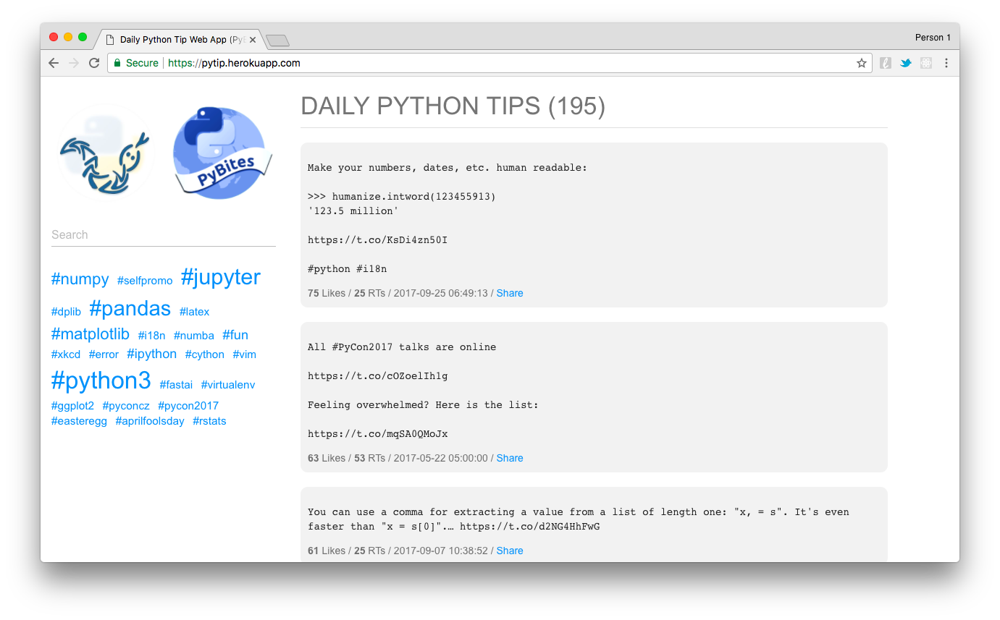

# Daily Python Tips

App built for [Code Challenge 40 - Daily Python Tip Part 1 - Make a Web App](https://pybit.es/codechallenge40.html)

I deployed it to [https://pytip.herokuapp.com](https://pytip.herokuapp.com)

## Setup

To run this app locally:

* Create a virtual env
* Create a DB called *pytip* (I use Postgres)
* Add env variables to venv/bin/activate:

	* Twitter API: CONSUMER_KEY / CONSUMER_SECRET / ACCESS_TOKEN / ACCESS_SECRET
	* DATABASE_URL = 'postgres://user:pw@localhost:5432/pytip' (tests use pytip_tests)
	* If your run it on Heroku set APP_LOCATION to *heroku* (similar deployment instructions as [prchecker](https://github.com/pybites/prchecker))

* Install the dependencies:

		pip install -r requirements.txt

* Get the [python_tip](https://twitter.com/python_tip) tweets:

		(venv) $ python tasks/import_tweets.py

* To run the tests create a postgres DB called *pytip_test*, then:

		(venv) $ pytest
		===  test session starts ===
		platform darwin -- Python 3.6.1, pytest-3.2.3, py-1.4.34, pluggy-0.4.0
		rootdir: /Users/bbelderb/Documents/code/pytip, inifile:
		collected 5 items

		tests/test_tasks.py .
		tests/test_tips.py ....

		=== 5 passed in 1.04 seconds ===

* Run the Bottle app:

		(venv) $ python app.py
		Bottle v0.12.13 server starting up (using WSGIRefServer())...
		Listening on http://localhost:8080/
		Hit Ctrl-C to quit.

* Enjoy!
